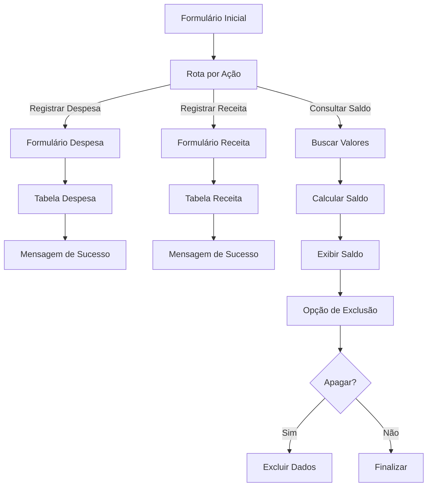

# 💰 Controle Financeiro — n8n

<video src="https://gist.github.com/user-attachments/assets/3f621205-96c5-4453-9b28-3cb72c4f7760" controls></video>

Automação de um sistema simples de **controle financeiro pessoal**, desenvolvido utilizando **n8n** como plataforma de automação e gerenciamento do fluxo de dados.

O projeto permite que diferentes usuários registrem receitas e despesas, consultem seu saldo financeiro e excluam seus próprios registros através de uma interface baseada em formulários.

---

## 📌 Sobre o Projeto

Este projeto foi desenvolvido como um experimento prático de **automação de processos utilizando n8n**, explorando integração entre formulários, regras de negócio e processamento através de código JavaScript.

O fluxo foi estruturado para suportar **opções**, mantendo os registros separados através de um identificador de opção.

Cada opção pode:

* Registrar despesas;
* Registrar receitas;
* Consultar seu saldo;
* Visualizar a quantidade de movimentações;
* Excluir seus próprios dados.

A opção é selecionada no início do fluxo e essa informação acompanha as operações realizadas posteriormente.

---

## 🚀 Funcionalidades

### 👤 Opções

O sistema possui um campo de identificação no formulário inicial.

Atualmente existem três opções de exemplo:

* 🟤 Bege
* 🔵 Azul
* 🟢 Verde

A opção selecionada é armazenada junto com cada movimentação financeira.

Isso permite consultar os registros utilizando a opção como filtro.

---

### 💸 Registro de Despesas

A opção pode registrar uma nova despesa informando:

* Valor;
* Categoria;
* Descrição;
* Data.

Categorias disponíveis no fluxo atual:

* Mercado;
* Farmácia;
* Padaria;
* Combustível.

Os dados são posteriormente armazenados na Data Table do n8n.

---

### 💰 Registro de Receitas

Também é possível registrar receitas informando:

* Valor;
* Produto;
* Data.

Atualmente o fluxo possui categorias como:

* Poupança;
* Ações da Bolsa;
* Tesouro Direto;
* Previdência Privada.

Os dados são armazenados juntamente com a opção responsável pelo lançamento.

---

### 📊 Consulta de Saldo

Ao selecionar **Consultar Saldo**, o fluxo busca somente os registros pertencentes a opção selecionada.

A consulta utiliza o campo `opção` como filtro:

```text
opção = opção selecionada
```

Depois disso, um nó `Code` processa os registros encontrados e calcula:

```text
Receitas
Despesas
Saldo
Quantidade de movimentações
```

A fórmula utilizada é:

```text
Saldo = Receita - Despesa
```

---

### 🧮 Cálculo do Saldo

O cálculo é realizado utilizando JavaScript dentro do n8n.

Exemplo da lógica:

```javascript
const rows = $input.all().filter(
  i => Object.keys(i.json).length > 0
);

let receita = 0;
let despesa = 0;

for (const i of rows) {
  const valor = Number(i.json.valor) || 0;
  const tipo = String(i.json.Tipo || '').toLowerCase();

  if (tipo === 'receita') {
    receita += valor;
  } else if (tipo === 'despesa') {
    despesa += valor;
  }
}

const saldo = receita - despesa;

return [{
  json: {
    receita,
    despesa,
    saldo,
    quantidade: rows.length
  }
}];
```

O resultado é apresentado ao usuário através de um formulário de saída.

---

### 🗑️ Exclusão de Dados

O sistema também possui uma opção para apagar os dados associados ao usuário.

Antes da exclusão existe um checkbox:

```text
☑ Deseja apagar os dados
```

Caso o usuário confirme, o fluxo executa a exclusão filtrando pela opção selecionada.

Isso evita que a exclusão seja realizada sobre os dados dos demais usuários.

---

# 🔄 Arquitetura do Workflow

O fluxo principal pode ser representado da seguinte maneira:



---

# 🧩 Estrutura do Workflow

O workflow utiliza diferentes tipos de nós do n8n para separar responsabilidades.

| Componente   | Responsabilidade        |
| ------------ | ----------------------- |
| Form Trigger | Inicia o fluxo          |
| Form         | Entrada de dados        |
| Switch       | Roteamento das ações    |
| Code         | Cálculo do saldo        |
| IF           | Controle da exclusão    |
| Completion   | Exibição dos resultados |

---

# 🗃️ Modelo de Dados

Os registros financeiros utilizam campos semelhantes a:

```text
Opção
Tipo
valor
Categoria
Descricao
registrado_em
```

Exemplo:

```json
{
  "Opção": "Azul",
  "Tipo": "Despesa",
  "valor": 150.50,
  "Categoria": "Mercado",
  "Descricao": "Compras da semana",
  "registrado_em": "2026-08-07"
}
```

---

# 🔐 Separação dos Usuários

Um dos principais pontos do projeto é o isolamento dos dados por opções de cores.

No cadastro de uma movimentação, a opção selecionada no primeiro formulário é recuperado posteriormente através da expressão:

```javascript
$('Primeira Etapa do Formulario').item.json.usuario
```

Esse valor é armazenado junto com o lançamento.

Na consulta, o mesmo identificador é utilizado para recuperar somente os registros daquele usuário.

Dessa forma:

```text
Opção Bege
   ↓
Registros da Opção Bege

Opção Azul
   ↓
Registros da Opção Azul

Opção Verde
   ↓
Registros da Opção Verde
```

---

# 🛠️ Tecnologias Utilizadas

* **n8n**
* **JavaScript**
* **n8n Forms**
* **n8n Data Tables**
* **Expressions do n8n**
* **HTML**
* **Mermaid**

---

# 📂 Estrutura do Projeto

Uma sugestão de organização para o repositório:

```text
controle-financeiro-n8n/
│
├── README.md
│
├── workflow/
│   └── controle-financeiro.json
│
```

O arquivo JSON do workflow pode ser exportado diretamente do n8n e armazenado no diretório `workflow`.

---

# ▶️ Como Executar

## 1. Instalar o n8n

Você pode executar o n8n localmente ou utilizar uma instância hospedada.

## 2. Importar o Workflow

No n8n:

```text
Workflows
   ↓
Import from File
   ↓
controle-financeiro.json
```

## 3. Configurar a Data Table

Crie uma Data Table chamada:

```text
Financas
```

com os campos utilizados pelo workflow.

## 4. Ativar o Workflow

Após importar e configurar os recursos necessários:

```text
Workflow
   ↓
Activate
```

O formulário poderá então ser utilizado para realizar os lançamentos.

---

# 📸 Fluxo da Aplicação

### 1. Seleção da opção

```text
┌─────────────────────────────┐
│          Finanças           │
├─────────────────────────────┤
│ Opção                       │
│ [ Bege ▼ ]                  │
│                             │
│ Ação                        │
│ [ Registrar Despesa ▼ ]     │
│                             │
│          [ Continuar ]      │
└─────────────────────────────┘
```

### 2. Registro

```text
┌─────────────────────────────┐
│          Despesa            │
├─────────────────────────────┤
│ Valor                       │
│ Categoria                   │
│ Descrição                   │
│ Data                        │
│                             │
│          [ Enviar ]         │
└─────────────────────────────┘
```

### 3. Consulta

```text
┌─────────────────────────────┐
│           Saldo             │
├─────────────────────────────┤
│ Receita:    R$ 5.000,00     │
│ Despesas:   R$ 2.000,00     │
│ --------------------------- │
│ Saldo:      R$ 3.000,00     │
└─────────────────────────────┘
```

---

# 🎯 Objetivos Técnicos

Este projeto foi desenvolvido com foco no aprendizado e aplicação prática de:

* Construção de workflows no n8n;
* Automação de processos;
* Criação de formulários;
* Roteamento condicional;
* Manipulação de dados com JavaScript;
* Uso de expressions;
* Estruturação de workflows;
* Tratamento de regras de negócio;
* Integração entre diferentes etapas de um processo automatizado.

---

# 📚 Aprendizados

O projeto demonstra como o **n8n pode ser utilizado não apenas para integrações entre APIs**, mas também para construir pequenos sistemas orientados a fluxo, combinando:

```text
Interface
    ↓
Regra de negócio
    ↓
Processamento
    ↓
Consulta
    ↓
Resultado
```

A utilização do `Switch`, `IF`, `Form`, `Data Table` e `Code` permite construir uma aplicação funcional utilizando uma arquitetura baseada em workflows.

---

# 👨‍💻 Autora

**Fernanda Chuerubim**

Data Analytics | Data Scientist | Python | Automation | Data Engineering | AI

---

## 📄 Licença

Este projeto utiliza dados fictícios, está disponível para fins de estudo, aprendizado e demonstração em portfólio.
